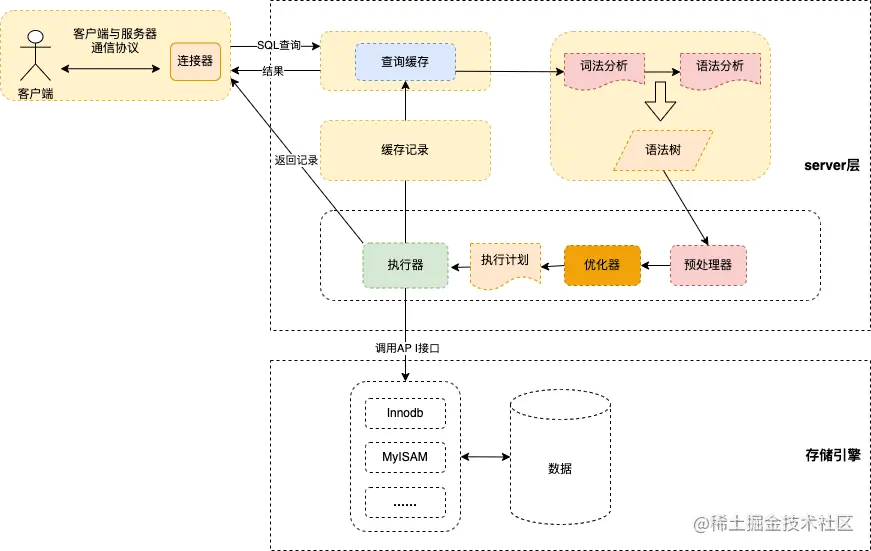

MySQL 45讲

# 0 课程介绍

> 极客时间  MySQL 实战 45 讲 https://time.geekbang.org/column/intro/100020801

## 你将获得

- 前腾讯云数据库负责人独家经验分享；
- MySQL 核心技术详解与原理说明；
- 36 个 MySQL 常见痛点问题解析；
- 完整的 MySQL 学习路径。

## 课程介绍

MySQL 使用和面试中遇到的问题，很多人会通过搜索别人的经验来解决 ，零散不成体系。实际上只要理解了 MySQL 的底层工作原理，就能很快地直戳问题的本质。

本专栏一共 **45** 讲，**全集**更新完毕，通过探讨 MySQL 实战中最常见的 **36 个** 痛点问题，串起各个零散的知识点，配合 **100+** 手绘详解图，由线到面带你构建 MySQL 系统的学习路径。

在专栏中，丁奇结合自己十多年来，通过 MySQL 源码找答案的经历，梳理了 **MySQL 的主线知识**，比如**事务、索引、锁**等；并基于这条主线，带你缕清**概念、机制、原理、案例分析**以及本质，让你真正能掌握 **MySQL 核心技术与底层原理。**

值得一提的是，每篇文章中都附有**实践案例**，给你从理论到实战的系统性指导，让你少走弯路，彻底搞懂 MySQL。

本课程共包括两大模块。

**模块一，基础篇**。为你深入浅出地讲述 MySQL 核心知识，涵盖 MySQL 基础架构、日志系统、事务隔离、锁等内容。

**模块二，实践篇**。将从一个个关键的数据库问题出发，分析数据库原理，并给出实践指导。每个问题，都不只是简单地给出答案，而是从为什么要这么想、到底该怎样做出发，让你能够知其所以然，都将能够解决你平时工作中的一个疑惑点。

## 课程目录


# 00 安装mysql

> 详见：https://www.runoob.com/mysql/mysql-install.html

```bash
# 下载
wget http://repo.mysql.com/mysql-community-release-el7-5.noarch.rpm
rpm -ivh mysql-community-release-el7-5.noarch.rpm
yum update
yum install mysql-server
```

权限设置：

```
chown -R mysql:mysql /var/lib/mysql/
```

初始化 MySQL：

```
mysqld --initialize
```

启动 MySQL：

```
systemctl start mysqld
```

查看 MySQL 运行状态：

```
systemctl status mysqld
```


查看初始密码：

```
grep password /var/log/mysql/mysqld.log 
2024-05-14T11:48:54.670531Z 6 [Note] [MY-010454] [Server] A temporary password is generated for root@localhost: 3d:Aw9u?-Tp!
```


登录后修改密码：

```bash
mysql -u root -p 3d:Aw9u?-Tp!
#修改密码
alter user 'root'@'localhost' identified by 'xxxxxx密码'
```


# 01 | 基础架构：一条SQL查询语句是如何执行的？

> https://juejin.cn/post/7130258357184626724 这篇文章更详细

下面是MySQL的基本架构示意图，从中你可以清楚地看到SQL语句在MySQL的各个功能模块中的执行过程。


<center>MySQL的逻辑架构图</center>

​		大体来说，MySQL可以分为Server层和存储引擎层两部分。

-  Server层包括连接器、查询缓存、分析器、优化器、执行器等，涵盖MySQL的大多数核心服务功能，以及所有的内置函数（如日期、时间、数学和加密函数等），所有跨存储引擎的功能都在这一层实现，比如存储过程、触发器、视图等。
- 而存储引擎层负责数据的存储和提取。其架构模式是插件式的，支持InnoDB、MyISAM、Memory等多个存储引擎。现在最常用的存储引擎是InnoDB，它从**MySQL 5.5.5**版本开始成为了默认存储引擎。

 以1条SQL语句，带你走一遍整个执行流程，依次看下每个组件的作用。       

```sql
mysql> select * from T where ID=10；
```



## 连接器

第一步，你会先连接到这个数据库上，这时候接待你的就是连接器。连接器负责跟客户端建立连接、获取权限、维持和管理连接。连接命令一般是这么写的：

```sql
mysql -h $ip -P $port -u $user -p
```

连接命令中的mysql是客户端工具，用来跟服务端建立连接。在完成经典的TCP握手后，连接器就要开始认证你的身份，这个时候用的就是你输入的用户名和密码。

- 如果用户名或密码不对，你就会收到一个"Access denied for user"的错误，然后客户端程序结束执行。
- 如果用户名密码认证通过，连接器会到权限表里面查出你拥有的权限。之后，这个连接里面的权限判断逻辑，都将依赖于此时读到的权限

这就意味着，一个用户成功建立连接后，即使你用管理员账号对这个用户的权限做了修改，也不会影响已经存在连接的权限。**修改完成后，只有再新建的连接才会使用新的权限设置**。  

连接完成后，如果你没有后续的动作，这个连接就处于空闲状态，你可以在**showprocesslist命令**中看到它。文本中这个图是showprocesslist的结果，其中的Command列显示为“Sleep”的这一行，就表示现在系统里面有一个空闲连接。

​                                                       

> 空闲连接会一直占用着吗？

客户端如果太长时间没动静，连接器就会自动将它断开。这个时间是由参数**wait_timeout（等待超时）**控制的，默认值是8小时。

```sql
mysql> show variables like 'wait_timeout';
+---------------+-------+
| Variable_name | Value |
+---------------+-------+
| wait_timeout  | 28800 |
+---------------+-------+
1 row in set (0.00 sec)
```

当然，我们自己也可以手动断开空闲的连接，使用的是 kill connection + id 的命令。

```sql
mysql> kill connection +6;
Query OK, 0 rows affected (0.00 sec)
```

如果在连接被断开之后，客户端再次发送请求的话，就会收到一个错误提醒： Lost connectionto MySQL server during query。这时候如果你要继续，就需要重连，然后再执行请求了。

数据库里面，**长连接**是指连接成功后，如果客户端持续有请求，则一直使用同一个连接。**短连接**则是指每次执行完很少的几次查询就断开连接，下次查询再重新建立一个。

建立连接的过程通常是比较复杂的，所以我建议你在使用中要尽量减少建立连接的动作，也就是**尽量使用长连接**。但是全部使用长连接后，你可能会发现，有些时候MySQL占用**内存涨得特别快**，这是因为MySQL在执行过程中临时使用的内存是管理在连接对象里面的。这些资源会在连接断开的时候才释放。所以如果长连接累积下来，可能导致内存占用太大，被系统强行杀掉（**OOM**），从现象看就是MySQL异常重启了。

> 怎么解决长连接长期占用内存这个问题呢？你可以考虑以下两种方案。

1. 定期断开长连接。使用一段时间，或者程序里面判断执行过一个占用内存的大查询后，断开连接，之后要查询再重连。

2. **客户端主动重置连接**。MySQL 5.7 版本实现了 `mysql_reset_connection()` 函数的接口，注意这是接口函数不是命令，那么当客户端执行了一个很大的操作后，在代码里调用 mysql_reset_connection 函数来重置连接，达到释放内存的效果。这个过程不需要重连和重新做权限验证，但是会将连接恢复到刚刚创建完时的状态。

   

> MySQL 的连接数有限制吗？

MySQL 服务支持的最大连接数由 **max_connections** 参数控制，比如我的 MySQL 服务默认是 151 个,超过这个值，系统就会拒绝接下来的连接请求，并报错提示“Too many connections”。

```sql
mysql> show variables like 'max_connections';
+-----------------+-------+
| Variable_name   | Value |
+-----------------+-------+
| max_connections | 151   |
+-----------------+-------+
1 row in set (0.00 sec)
```


## 查询缓存

连接建立完成后，你就可以执行select语句了。执行逻辑就会来到第二步：查询缓存。

MySQL拿到一个查询请求后，会先到查询缓存看看，之前是不是执行过这条语句。之前执行过的语句及其结果可能会以key-value对的形式，被直接缓存在内存中。key是查询的语句，value是查询的结果。如果你的查询能够直接在这个缓存中找到key，那么这个value就会被直接返回给客户端。

如果语句不在查询缓存中，就会继续后面的执行阶段。执行完成后，执行结果会被存入查询缓存中。你可以看到，如果查询命中缓存，MySQL不需要执行后面的复杂操作，就可以直接返回结果，这个效率会很高。

> 但是大多数情况下我会建议你不要使用查询缓存，为什么呢？

因为查询缓存往往弊大于利。**查询缓存的失效非常频繁**，只要有对一个表的更新，这个表上所有的查询缓存都会被清空。因此很可能你费劲地把结果存起来，还没使用呢，就被一个更新全清空了。对于更新压力大的数据库来说，查询缓存的命中率会非常低。除非你的业务就是有一张静态表，很长时间才会更新一次。比如，一个系统配置表，那这张表上的查询才适合使用查询缓存。

好在MySQL也提供了这种“按需使用”的方式。你可以将参数**query_cache_type设置成DEMAND**，这样对于默认的SQL语句都不使用查询缓存。而对于你确定要使用查询缓存的语句，可以用SQL_CACHE显式指定，像下面这个语句一样：

```sql
mysql> select SQL_CACHE * from T where ID=10;
```

需要注意的是，MySQL 8.0版本直接将查询缓存的整块功能删掉了，也就是说8.0开始彻底没有这个功能了。


## 分析器

如果没有命中查询缓存，就要开始真正执行语句了。首先，MySQL需要知道你要做什么，因此需要对SQL语句做解析。

1、词法分析

分析器先会做“词法分析”。你输入的是由多个字符串和空格组成的一条SQL语句，MySQL需要识别出里面的字符串分别是什么，代表什么。

MySQL从你输入的"select"这个关键字识别出来，这是一个查询语句。它也要把字符串“T”识别成“表名T”，把字符串“ID”识别成“列ID”。


2、语法分析

做完了这些识别以后，就要做“语法分析”。根据词法分析的结果，语法分析器会根据语法规则，判断你输入的这个SQL语句是否满足MySQL语法。

如果你的语句不对，就会收到**“You have an error in your SQL syntax”的错误提醒**，比如下面这个语句select少打了开头的字母“s”。

```sql
mysql> elect * from t where ID=1;
ERROR 1064 (42000): You have an error in your SQL syntax; check the manual that corresponds to your MySQL server version for the right syntax to use near 'elect * from t where ID=1' at line 1
```

一般语法错误会提示第一个出现错误的位置，所以你要关注的是紧接“use near”的内容。


## 优化器 

经过了分析器，MySQL就知道你要做什么了。在开始执行之前，还要先经过优化器的处理。

**优化器是在表里面有多个索引的时候，决定使用哪个索引；或者在一个语句有多表关联（join）的时候，决定各个表的连接顺序**。

比如你执行下面这样的语句，这个语句是执行两个表的join：

```sql
mysql> select * from t1 join t2 using(ID) where t1.c=10 and t2.d=20;
```

- 既可以先从表t1里面取出c=10的记录的ID值，再根据ID值关联到表t2，再判断t2里面d的值是否等于20。
- 也可以先从表t2里面取出d=20的记录的ID值，再根据ID值关联到t1，再判断t1里面c的值是否等于10。

这两种执行方法的逻辑结果是一样的，但是执行的效率会有不同，而优化器的作用就是决定选择使用哪一个方案。

优化器阶段完成后，这个语句的执行方案就确定下来了，然后进入执行器阶段。如果你还有一些疑问，比如优化器是怎么选择索引的，有没有可能选择错等等，没关系，在后面的文章中单独展开说明优化器的内容。

（小表驱动大表会好点？）


## 执行器

MySQL通过分析器知道了你要做什么，通过优化器知道了该怎么做，于是就进入了执行器阶段，开始执行语句。

开始执行的时候，要先判断一下你对这个表T有没有执行查询的**权限**，如果没有，就会返回没有权限的错误，如下所示：

```sql
mysql> select * from T where ID=10;
ERROR 1142 (42000): SELECT command denied to user 'b'@'localhost' for table 'T'
```

如果有权限，就打开表继续执行。打开表的时候，执行器就会根据表的引擎定义，去使用这个引擎提供的接口。

比如我们这个例子中的表T中，ID字段没有索引，那么执行器的执行流程是这样的（全表查询）：

1. 调用InnoDB引擎接口取这个表的第一行，判断ID值是不是10，如果不是则跳过，如果是则

将这行存在结果集中；

2. 调用引擎接口取“下一行”，重复相同的判断逻辑，直到取到这个表的最后一行。

3. 执行器将上述遍历过程中所有满足条件的行组成的记录集作为结果集返回给客户端。

至此，这个语句就执行完成了，

对于有索引的表，执行的逻辑也差不多。第一次调用的是“取满足条件的第一行”这个接口，之后循环取“满足条件的下一行”这个接口，这些接口都是引擎中已经定义好的。


你会在数据库的慢查询日志中看到一个**rows_examined的字段，表示这个语句执行过程中扫描了多少行**。这个值就是在执行器每次调用引擎获取数据行的时候累加的。

在有些场景下，执行器调用一次，在引擎内部则扫描了多行，因此引擎扫描行数跟rows_examined 并不是完全相同的。 后面会专门有一篇文章来讲存储引擎的内部机制，里面会有详细的说明。


## 思考题

如果表T中没有字段k，而你执行了这个语句 select *fromTwhere k=1, 那肯定是会报“不存在这个列”的错误： “Unknown column ‘k’ in ‘where clause’”。你觉得这个错误是在我们上面提到的哪个阶段报出来的呢？

（分析器？

查询解析阶段：在这个阶段，MySQL 解析查询语句的语法和语义，检查语句的正确性，并生成相应的查询执行计划。在这个阶段，MySQL 会检查表和列是否存在，但不会检查列的值）


# 02 | 日志系统：一条SQL更新语句是如何执行的？

一条更新语句的执行流程又是怎样的呢？

**之前你可能经常听DBA同事说，MySQL可以恢复到半个月内任意一秒的状态**，惊叹的同时，你是不是心中也会不免会好奇，这是怎样做到的呢？

我们还是从一个表的一条更新语句说起，下面是这个表的创建语句，这个表有一个主键ID和一个整型字段c：

```sql
mysql> create table T(ID int primary key, c int);
```

如果要将ID=2这一行的值加1，SQL语句就会这么写：

```sql
mysql> update T set c=c+1 where ID=2;
```


还是看这个架构图。

你执行语句前要先连接数据库，这是连接器的工作。

前面我们说过，在一个表上有更新的时候，跟这个表有关的查询缓存会失效，所以这条语句就会把表T上所有缓存结果都清空。这也就是我们一般不建议使用查询缓存的原因。

接下来，分析器会通过词法和语法解析知道这是一条更新语句。优化器决定要使用ID这个索引。然后，执行器负责具体执行，找到这一行，然后更新。

**与查询流程不一样的是，更新流程还涉及两个重要的日志模块，它们正是我们今天要讨论的主角：redo log（重做日志）和 binlog（归档日志）**。


## **redo log**（重做日志）

在MySQL里，如果每一次的更新操作都需要写进磁盘，然后磁盘也要找到对应的那条记录，然后再更新，整个过程IO成本、查找成本都很高。

为了解决这个问题，MySQL的设计者就用了类似酒店掌柜粉板（临时记录，最后再一起核算）的思路来提升更新效率。

而粉板和账本配合的整个过程，其实就是MySQL里经常说到的WAL技术，WAL的全称是**Write Ahead Logging（写前日志）**，它的关键点就是先写日志，再写磁盘，也就是先写粉板，等不忙的时候再写账本。


具体来说，当有一条记录需要更新的时候，InnoDB引擎就会先把记录写到redo log（粉板）里面，**并更新内存**，这个时候更新就算完成了。同时，InnoDB引擎会在适当的时候，将这个操作记录更新到磁盘里面，而这个更新往往是在系统比较空闲的时候做，这就像打烊以后掌柜做的事。


InnoDB的redo log是固定大小的，比如可以配置为一组4个文件，每个文件的大小是1GB，那么这块“粉板”总共就可以记录4GB的操作。从头开始写，写到末尾就又回到开头循环写，如下面这个图所示。


**write pos**是当前记录的位置，一边写一边后移，写到第3号文件末尾后就回到0号文件开头。**checkpoint**是当前要擦除的位置，也是往后推移并且循环的，擦除记录前要把记录更新到数据文件。

write pos和checkpoint之间的是“粉板”上还空着的部分，可以用来记录新的操作。如果write pos追上checkpoint，表示“粉板”满了，这时候不能再执行新的更新，得停下来先擦掉一些记录，把checkpoint推进一下。（双指针设计得很合理）

有了redo log，InnoDB就可以保证即使数据库发生异常重启，之前提交的记录都不会丢失，这个能力称为**crash-safe**（奔溃安全）。

**innodb_flush_log_at_trx_commit这个参数设置成1的时候，表示每次事务的redo log都直接持久化到磁盘。**这个参数我建议你设置成1，这样可以保证MySQL异常重启之后数据不丢失。


这个Redo Log 是在磁盘上存储的，而不是在内存中。

Redo Log 记录了对数据库进行的修改操作，例如插入、更新和删除操作。当事务提交时，相关的 Redo Log 记录会被写入磁盘，以确保在数据库崩溃或故障恢复时，可以通过重放 Redo Log 来恢复未完成的事务。

尽管 Redo Log 是在磁盘上存储的，但在实际操作中，MySQL 会**使用缓冲区（Buffer）来管理 Redo Log 的写入**。这是为了提高性能，避免每次修改都直接写入磁盘。MySQL 会将 Redo Log 记录先写入到内存的缓冲区中，然后根据一定的策略将缓冲区中的内容刷新到磁盘上的 Redo Log 文件中。


## **binlog（归档日志）**

MySQL整体来看，其实就有两块：一块是Server层，它主要做的是MySQL功能

层面的事情；还有一块是引擎层，负责存储相关的具体事宜。上面我们聊到的粉板redo log是InnoDB引擎特有的日志，而**Server层也有自己的日志，称为binlog（归档日志）**

你肯定会问，为什么会有两份日志呢？

因为最开始MySQL里并没有InnoDB引擎。MySQL自带的引擎是MyISAM，但是MyISAM没有crash-safe的能力，binlog日志只能用于归档。而InnoDB是另一个公司以插件形式引入MySQL的，既然只依靠binlog是没有crash-safe能力的，所以InnoDB使用另外一套日志系统— — 也就是redo log来实现crash-safe能力。

**sync_binlog这个参数设置成1的时候，表示每次事务的binlog都持久化到磁盘。**这个参数我也建议你设置成1，这样可以保证MySQL异常重启之后binlog不丢失


这两种日志有以下三点不同。

1. redo log是InnoDB引擎特有的；binlog是MySQL的Server层实现的，所有引擎都可以使用。

2. redo log是物理日志，记录的是“在某个数据页上做了什么修改”；binlog是逻辑日志，记录的是这个语句的原始逻辑，比如“给ID=2这一行的c字段加1 ”。

3. redo log是循环写的，空间固定会用完；binlog是可以追加写入的。“追加写”是指binlog文件写到一定大小后会切换到下一个，并不会覆盖以前的日志。


有了对这两个日志的概念性理解，我们再来看执行器和InnoDB引擎在执行这个简单的update语句时的内部流程：

1. 执行器先找引擎取ID=2这一行。ID是主键，引擎直接用树搜索找到这一行。如果ID=2这一行所在的数据页本来就在内存中，就直接返回给执行器；否则，需要先从磁盘读入内存，然后再返回。

2. 执行器拿到引擎给的行数据，把这个值加上1，比如原来是N，现在就是N+1，得到新的一行数据，再调用引擎接口写入这行新数据。

3. 引擎将这行新数据更新到内存中，同时将这个更新操作**记录到redo log里面**，此时redo log处于prepare状态。然后**告知执行器执行完成了**，随时可以提交事务。

4. 执行器生成这个操作的binlog，并把binlog写入磁盘.(异步的？)

5. 执行器调用引擎的提交事务接口，引擎把刚刚写入的redo log改成提交（commit）状态，更新完成。

下面是update语句的执行流程图，图中浅色框表示是在InnoDB内部执行的，深色框表示是在执行器中执行的。


<center>update语句执行流程</center>

你可能注意到了，最后三步看上去有点“绕”，将redo log的写入拆成了两个步骤：prepare和commit，这就是"两阶段提交"。


## 两阶段提交

为什么必须有“两阶段提交”呢？这是为了让两份日志之间的逻辑一致。要说明这个问题，我们得

从文章开头的那个问题说起：怎么让数据库恢复到半个月内任意一秒的状态？

前面我们说过了，**binlog会记录所有的逻辑操作**，并且是采用“追加写”的形式。如**果你的DBA承诺说半个月内可以恢复，那么备份系统中一定会保存最近半个月的所有binlog，同时系统会定期做整库备份。**这里的“定期”取决于系统的重要性，可以是一天一备，也可以是一周一备

当需要恢复到指定的某一秒时，比如某天下午两点发现中午十二点有一次误删表，需要找回数

据，那你可以这么做：

- 首先，找到最近的一次全量备份，如果你运气好，可能就是昨天晚上的一个备份，从这个备份恢复到临时库；
- 然后，从备份的时间点开始，将备份的binlog依次取出来，重放到中午误删表之前的那个时刻。

这样你的临时库就跟误删之前的线上库一样了，然后你可以把表数据从临时库取出来，按需要恢复到线上库去。

好了，说完了数据恢复过程，我们回来说说，为什么日志需要“两阶段提交”。这里不妨用反证法来进行解释。

由于redo log和binlog是两个独立的逻辑，如果不用两阶段提交，要么就是先写完redo log再写binlog，或者采用反过来的顺序。我们看看这两种方式会有什么问题。仍然用前面的update语句来做例子。假设当前ID=2的行，字段c的值是0，再假设执行update语句过程中在写完第一个日志后，第二个日志还没有写完期间发生了crash，会出现什么情况呢？

（数据以redo log为准，这个WAL写了就表示操作成功了）

**1、先写redo log在写binlog 会造成恢复数据时的数据缺失。**假设在redo log写完，binlog还没有写完的时候，MySQL进程异常重启。由于我们前面说过的，redo log写完之后，系统即使崩溃，仍然能够把数据恢复回来，所以恢复后这一行c的值是1。但是由于binlog没写完就crash了，这时候binlog里面就没有记录这个语句。因此，之后备份日志的时候，存起来的binlog里面就没有这条语句。然后你会发现，如果需要用这个binlog来恢复临时库的话，由于这个语句的binlog丢失，这个临时库就会少了这一次更新，恢复出来的这一行c的值就是0，与原库的值不同

2、先写binlog在写redo log 。如果在binlog写完之后crash，由于redo log还没写，崩溃恢复以后这个事务无效，所以这一行c的值是0。但是binlog里面已经记录了“把c从0改成1”这个日志。所以，在之后用binlog来恢复的时候就多了一个事务出来，恢复出来的这一行c的值就是1，与原库的值不同


可以看到，如果不使用“两阶段提交”，那么数据库的状态就有可能和用它的日志恢复出来的库的状态不一致。

你可能会说，这个概率是不是很低，平时也没有什么动不动就需要恢复临时库的场景呀？

其实不是的，不只是误操作后需要用这个过程来恢复数据。当你需要**扩容的时候**，也就是需要再多搭建一些备库来增加系统的读能力的时候，**现在常见的做法也是用全量备份加上应用binlog来实现的**，这个“不一致”就会导致你的线上出现主从数据库不一致的情况。

简单说，redo log和binlog都可以用于表示事务的提交状态，而两阶段提交就是让这两个状态保持逻辑上的一致。


**两阶段提交是==跨系统==维持数据逻辑一致性时常用的一个方案，即使你不做数据库内核开发，日常开发中也有可能会用到**。


## 思考题

定期全量备份的周期“取决于系统重要性，有的是一天一备，有的是一周一备”。那么在什么场景下，一天一备会比一周一备更有优势呢？或者说，它影响了这个数据库系统的哪个指标？

> chatGPT回答

一天一备的优势：

1. 数据恢复点更近：一天一备意味着在发生故障或数据丢失时，可以恢复到最近一天的备份。**这可以减少数据丢失的程度，尤其是对于频繁发生数据变更的系统**。
2. 数据恢复时间较短：由于备份频率较高，恢复数据所需的时间相对较短。这对于需要快速恢复数据库的系统非常重要，以减少业务中断时间。

一周一备的优势：

1. 节省存储空间：一周一备相对于一天一备可以减少备份数据的存储需求。如果数据量庞大，每天进行全量备份可能会占用大量的存储空间。一周一备可以在一定程度上减少存储成本。
2. 减少备份过程对系统性能的影响：进行全量备份可能会对数据库系统的性能产生一定的影响。一周一备相对于一天一备可以减少备份过程对系统性能的影响，尤其是对于大型数据库系统。

备份策略的选择会影响数据库系统的可恢复性和可用性指标。一天一备可以提供更近的数据恢复点和较短的恢复时间，从而减少数据丢失和业务中断时间。而一周一备可以节省存储空间和减少备份过程对系统性能的影响。

需要根据具体的业务需求、数据变更频率和系统重要性来评估并选择适合的备份策略。有些系统可能需要更频繁的备份以确保数据的安全性和可恢复性，而对于其他系统，一周一备可能已经足够满足需求。

> 作者回答

好处是“最长恢复时间”更短。

在一天一备的模式里，最坏情况下需要应用一天的binlog。比如，你每天0点做一次全量备份，

而要恢复出一个到昨天晚上23点的备份。

一周一备最坏情况就要应用一周的binlog了。

系统的对应指标就是 RTO（**Recovery Time Objective**，恢复时间目标），具体见[这里](https://www.dell.com/community/zh/conversations/%E6%95%B0%E6%8D%AE%E4%BF%9D%E6%8A%A4%E8%AE%A8%E8%AE%BA%E5%8C%BA/%E6%81%A2%E5%A4%8D%E6%97%B6%E9%97%B4%E7%9B%AE%E6%A0%87rto%E5%92%8C%E6%81%A2%E5%A4%8D%E7%82%B9%E7%9B%AE%E6%A0%87rpo/647f86edf4ccf8a8de60d31e)。

当然这个是有成本的，因为更频繁全量备份需要消耗更多存储空间，所以这个RTO是成本换来

的，就需要你根据业务重要性来评估了


# 03 | 事务隔离：为什么你改了我还看不见？

事务就是要保证一组数据库操作，要么全部成功，要么全部失败（原子性）。在MySQL中，**事务支持是在引擎层实现的**。

道，MySQL是一个支持多引擎的系统，但并不是所有的引擎都支持事务。比如M**ySQL原生的MyISAM引擎就不支持事务，这也是MyISAM被InnoDB取代**

**的重要原因之一**。

今天的文章以InnoDB为例，剖析MySQL在事务支持方面的特定实现，并基于原理给出相应的实践建议，希望这些案例能加深你对MySQL事务原理的理解


## 隔离性与隔离级别

提到事务，你肯定会想到ACID（Atomicity、Consistency、Isolation、Durability，即原子性、一致性、隔离性、持久性），今天我们就来说说其中I，也就是“隔离性”。

当数据库上有多个事务同时执行的时候，就可能出现脏读（dirty read）、不可重复读（non-repeatable read）、**幻读（phantomread）**的问题，为了解决这些问题，就有了“隔离级别”的概念。


隔离得越严实，效率就会越低。因此很多时候，我们都要在二者之间寻找一个平衡点。SQL标准的事务隔离级别包括：读未提交（read uncommitted）、

读提交（read committed）、可重复读（repeatable read）和串行化（serializable ）。下面逐一为你解释：

- 读未提交是指，一个事务还没提交时，它做的变更就能被别的事务看到。
- 读提交是指，一个事务提交之后，它做的变更才会被其他事务看到。
- 可重复读是指，**一个事务执行过程中看到的数据，总是跟这个事务在启动时看到的数据是一致的**。当然在可重复读隔离级别下，未提交变更对其他事务也是不可见的。
- 串行化，顾名思义是对于同一行记录，“写”会加“写锁”，“读”会加“读锁”。当出现读写锁冲突的时候，后访问的事务必须等前一个事务执行完成，才能继续执行。


其中“读提交”和“可重复读”比较难理解，下面一个例子说明这几种隔离级别。假设数据表T中只有一列，其中一行的值为1，下面是按照时间顺序执行两个事务的行为。

```bash
mysql> create table T(c int) engine=InnoDB;
insert into T(c) values(1);
```


在不同的隔离级别下，事务A会有哪些不同的返回结果，也就是图里面V1、V2、V3的返回值分别是什么。

- 若隔离级别是“读未提交”， 则V1的值就是2。这时候事务B虽然还没有提交，但是结果已经被A看到了。因此，V2、V3也都是2。
- 若隔离级别是“读提交”，则V1是1，V2的值是2。事务B的更新在提交后才能被A看到。所以，V3的值也是2。
- 若隔离级别是“可重复读”，则V1、V2是1，V3是2。之所以V2还是1，遵循的就是这个要求：事务在执行期间看到的数据前后必须是一致的。
- **若隔离级别是“串行化”，则在事务B执行“将1改成2”的时候，会被锁住**。直到事务A提交后，事务B才可以继续执行。所以从A的角度看， V1、V2值是1，V3的值是2。

**在实现上，数据库里面会创建一个视图**，访问的时候以视图的逻辑结果为准。

- 在“可重复读”隔离级别下，这个视图是在事务启动时创建的，整个事务存在期间都用这个视图。
- 在“读提交”隔离级别下，这个视图是在每个SQL语句开始执行的时候创建的
- “读未提交”隔离级别下直接返回记录上的最新值，没有视图概念；
- 而“串行化”隔离级别下直接用加锁的方式来避免并行访问

在不同的隔离级别下，数据库行为是有所不同的。Oracle数据库的默认隔离级别其实就是“读提交”，因此对于一些从Oracle迁移到MySQL的应用，为保证数据库隔离级别的一致，你一定要记得将MySQL的隔离级别设置为“读提交”。

配置的方式是，将启动参数transaction-isolation的值设置成READ-COMMITTED。你可以用showvariables来查看当前的值

```bash
mysql> show variables like 'transaction_isolation';
+-----------------------+----------------+
| Variable_name | Value |
+-----------------------+----------------+
| transaction_isolation | READ-COMMITTED |
+-----------------------+----------------+
```


总结来说，存在即合理，哪个隔离级别都有它自己的使用场景，你要根据自己的业务情况来定。

什么情况下会用到“可重复读“的场景？

假设你在管理一个个人银行账户表。一个表存了每个月月底的余额，一个表存了账单明细。这时候你要做数据校对，也就是判断上个月的余额和当前余额的差额，是否与本月的账单明细一致。你一定希望在校对过程中，即使有用户发生了一笔新的交易，也不影响你的校对结果。这时候使用“可重复读”隔离级别就很方便。事务启动时的视图可以认为是静态的，不受其他事务更新的影响。


## 事务隔离的实现

理解了事务的隔离级别，我们再来看看事务隔离具体是怎么实现的。这里我们展开说明“可重复读”。

在MySQL中，实际上每条记录在更新的时候都会同时记录一条回滚操作。记录上的最新值，通过回滚操作，都可以得到前一个状态的值。

假设一个值从1被按顺序改成了2、3、4，在回滚日志里面就会有类似下面的记录。


当前值是4，但是在查询这条记录的时候，不同时刻启动的事务会有不同的read-view。如图中看到的，在视图A、B、C里面，这一个记录的值分别是1、2、4，同一条记录在系统中可以存在多个版本，就是数据库的多版本并发控制（MVCC）。对于read-viewA，要得到1，就必须将当前值依次执行图中所有的回滚操作得到。


同时你会发现，即使现在有另外一个事务正在将4改成5，这个事务跟read-viewA、B、C对应的事务是不会冲突的。

你一定会问，回滚日志总不能一直保留吧，什么时候删除呢？答案是，在不需要的时候才删除。也就是说，**系统会判断，当没有事务再需要用到这些回滚日志时，回滚日志会被删除**。

什么时候才不需要了呢？**就是当系统里没有比这个回滚日志更早的read-view的时候**。


基于上面的说明，我们来讨论一下为什么建议你尽量不要使用长事务。

1、**长事务意味着系统里面会存在很老的事务视图**。由于这些事务随时可能访问数据库里面的任何数据，所以这个事务提交之前，数据库里面它可能用到的回滚记录都必须保留，这就会导致大量占用存储空间。

**在MySQL 5.5及以前的版本，回滚日志是跟数据字典一起放在ibdata文件里的，即使长事务最终提交，回滚段被清理，文件也不会变小**。我见过数据只有20GB，而回滚段有200GB的库。最终只好为了清理回滚段，重建整个库。

2、除了对回滚段的影响，**长事务还占用锁资源**，也可能拖垮整个库，这个我们会在后面讲锁的时候展开。


## 事务的启动方式

如前面所述，长事务有这些潜在风险，我当然是建议你尽量避免。其实很多时候业务开发同学并不是有意使用长事务，通常是由于误用所致。MySQL的事务启动方式有以下几种：

1. **显式启动事务语句**， begin 或 start transaction。配套的提交语句是commit，回滚语句是rollback。

2. **set autocommit=0**，这个命令会将这个线程的自动提交关掉。意味着如果你只执行一个select语句，这个事务就启动了，而且并不会自动提交。这个事务持续存在直到你主动执行commit 或 rollback 语句，或者断开连接。

有些客户端连接框架会默认连接成功后先执行一个set autocommit=0的命令。这就导致接下来的查询都在事务中，如果是长连接，就导致了意外的长事务。

因此，建议你总是使用set autocommit=1, 并通过显式语句的方式来启动事务。

PS: 客户端请求时总会新建一个事务， autocommit只是设置了是否自动提交事务。且当begin显式开启事务时，只有commit才会提交事务（无关autocommit设置）


但是有的开发同学会**纠结“多一次交互”的问题**。对于一个需要频繁使用事务的业务，第二种方式每个事务在开始时都不需要主动执行一次 “begin”，减少了语句的交互次数。如果你也有这个顾虑，**建议你使用commit work and chain语法**。

在autocommit为1的情况下，用begin显式启动的事务，如果执行commit则提交事务。**如果执行commit work and chain，则是提交事务并自动启动下一个事务，这样也省去了再次执行begin语句的开销**。同时带来的好处是从程序开发的角度明确地知道每个语句是否处于事务中。


你可以在information_schema库的innodb_trx这个表中查询长事务，比如下面这个语句，用于查找持续时间超过60s的事务。

```mysql
select * from information_schema.innodb_trx where TIME_TO_SEC(timediff(now(),trx_started))>60;
```

PS：事务表表结构

```mysql
mysql> describe information_schema.innodb_trx;
+----------------------------+---------------------+------+-----+---------------------+-------+
| Field                      | Type                | Null | Key | Default             | Extra |
+----------------------------+---------------------+------+-----+---------------------+-------+
| trx_id                     | varchar(18)         | NO   |     |                     |       |
| trx_state                  | varchar(13)         | NO   |     |                     |       |
| trx_started                | datetime            | NO   |     | 0000-00-00 00:00:00 |       |
| trx_requested_lock_id      | varchar(81)         | YES  |     | NULL                |       |
| trx_wait_started           | datetime            | YES  |     | NULL                |       |
| trx_weight                 | bigint(21) unsigned | NO   |     | 0                   |       |
| trx_mysql_thread_id        | bigint(21) unsigned | NO   |     | 0                   |       |
| trx_query                  | varchar(1024)       | YES  |     | NULL                |       |
| trx_operation_state        | varchar(64)         | YES  |     | NULL                |       |
| trx_tables_in_use          | bigint(21) unsigned | NO   |     | 0                   |       |
| trx_tables_locked          | bigint(21) unsigned | NO   |     | 0                   |       |
| trx_lock_structs           | bigint(21) unsigned | NO   |     | 0                   |       |
| trx_lock_memory_bytes      | bigint(21) unsigned | NO   |     | 0                   |       |
| trx_rows_locked            | bigint(21) unsigned | NO   |     | 0                   |       |
| trx_rows_modified          | bigint(21) unsigned | NO   |     | 0                   |       |
| trx_concurrency_tickets    | bigint(21) unsigned | NO   |     | 0                   |       |
| trx_isolation_level        | varchar(16)         | NO   |     |                     |       |
| trx_unique_checks          | int(1)              | NO   |     | 0                   |       |
| trx_foreign_key_checks     | int(1)              | NO   |     | 0                   |       |
| trx_last_foreign_key_error | varchar(256)        | YES  |     | NULL                |       |
| trx_adaptive_hash_latched  | int(1)              | NO   |     | 0                   |       |
| trx_adaptive_hash_timeout  | bigint(21) unsigned | NO   |     | 0                   |       |
| trx_is_read_only           | int(1)              | NO   |     | 0                   |       |
| trx_autocommit_non_locking | int(1)              | NO   |     | 0                   |       |
+----------------------------+---------------------+------+-----+---------------------+-------+
24 rows in set (0.00 sec)
```

## 思考题

你现在知道了系统里面应该避免长事务，如果你是业务开发负责人同时也是数据库负责人，你会有什么方案来避免出现或者处理这种情况呢？

> chatGPT回答

作为业务开发负责人和数据库负责人，以下是一些方案来避免或处理长事务的情况：

1. 优化查询和事务逻辑：通过优化查询语句和事务逻辑，可以减少事务的执行时间。这包括使用合适的索引、避免全表扫描、减少不必要的查询和锁定等。定期进行性能优化和代码审查，确保查询和事务逻辑的效率和合理性。
2. 分批处理和批量提交：对于大批量的数据操作，可以将其分批处理，避免一次性处理过多的数据。同时，可以使用批量提交的方式，将多个操作合并为一个事务，减少事务的数量和执行时间。
3. 合理设置事务超时时间：设置适当的事务超时时间，避免长时间占用数据库资源。如果事务执行时间超过设定的超时时间，可以主动回滚事务并记录相关日志，以便后续分析和处理。
4. 监控和报警：建立监控系统，实时监测数据库的事务执行情况和性能指标。设置合适的阈值和报警规则，及时发现长事务的存在，并采取相应的措施进行处理。
5. 分布式事务管理：对于分布式系统中的事务，可以采用分布式事务管理方案，如使用消息队列、分布式事务协调器等，确保事务的一致性和可靠性。
6. 定期维护和优化数据库：定期进行数据库维护和优化工作，包括索引重建、统计信息更新、碎片整理等，以提高数据库的性能和稳定性。
7. 数据库复制和备份：使用数据库复制和备份机制，确保数据的可靠性和可恢复性。在出现长事务或其他故障时，可以通过备份数据进行恢复，避免数据丢失和业务中断。

总之，通过优化查询和事务逻辑、分批处理和批量提交、合理设置事务超时时间、监控和报警、分布式事务管理、定期维护和优化数据库以及数据库复制和备份等方案，可以有效地避免或处理长事务的情况，提高数据库的性能和可靠性。

> 作者回答

首先，从应用开发端来看：

1. 确认是sdk否使用了set autocommit=0。这个确认工作可以在测试环境中开展，把MySQL的**general_log**开起来，然后随便跑一个业务逻辑，通过general_log的日志来确认。一般框架如果会设置这个值，也就会提供参数来控制行为，你的目标就是把它改成1。

2. 确认是否有不必要的只读事务。有些框架会习惯不管什么语句先用begin/commit框起来。我见过有些是业务并没有这个需要，但是也把好几个select语句放到了事务中。这种只读事务可以去掉。

3. 业务连接数据库的时候，根据业务本身的预估，通过**SETMAX_EXECUTION_TIME**命令，来控制每个语句执行的最长时间，避免单个语句意外执行太长时间。（为什么会意外？在后续的文章中会提到这类案例）

其次，从数据库端来看：

1. 监控 information_schema.Innodb_trx表，设置长事务阈值，超过就报警/或者kill；

2. Percona的pt-kill这个工具不错，推荐使用；

3. 在业务功能测试阶段要求输出所有的general_log，分析日志行为提前发现问题；

4. 如果使用的是MySQL 5.6或者更新版本，把innodb_undo_tablespaces设置成2（或更大的值）。如果真的出现大事务导致回滚段过大，这样设置后清理起来更方便。


## 补充

### 事务相关指令

1. 显示当前事务状态：

   ```
   SHOW ENGINE INNODB STATUS;
   ```

   这个命令将显示InnoDB存储引擎的状态信息，其中包含了当前事务的相关信息，如事务ID、事务状态等。

2. 开启事务：

   ```
   START TRANSACTION;
   ```

   这个命令用于显式地开启一个事务。在事务中执行的SQL语句将被视为一个原子操作，要么全部执行成功，要么全部回滚。

3. 提交事务：

   ```
   COMMIT;
   ```

   这个命令用于提交当前事务，将之前在事务中执行的SQL语句永久保存到数据库中。

4. 回滚事务：

   ```
   ROLLBACK;
   ```

   这个命令用于回滚当前事务，撤销之前在事务中执行的SQL语句对数据库的修改。

需要注意的是，MySQL默认情况下处于自动提交模式（autocommit），即每个SQL语句都被视为一个独立的事务并自动提交。如果要使用显式事务管理，可以通过设置`autocommit`参数为0来禁用自动提交：

```
SET autocommit = 0;
```

这样，在执行SQL语句时，~~需要显式地使用`START TRANSACTION`来开启事务，并~~使用`COMMIT`或`ROLLBACK`来结束事务。


### 开启general_log

MySQL的general_log是一种日志记录功能，它可以记录MySQL服务器上执行的所有SQL语句，包括查询、更新、事务等操作。通过开启general_log，可以详细了解MySQL服务器上的数据库操作情况，方便进行故障排查、性能分析和安全审计等工作。

要开启MySQL的general_log，可以按照以下步骤进行：

0、查看开启情况

```sql
mysql> show variables like '%general_log%';
+------------------+-------------------------------------+
| Variable_name    | Value                               |
+------------------+-------------------------------------+
| general_log      | OFF                                 |
| general_log_file | /var/lib/mysql/VM-32-165-centos.log |
+------------------+-------------------------------------+

## 临时生效
mysql> set global general_log=on;
```

1、编辑MySQL的配置文件（my.cnf或my.ini），找到并修改以下参数：

```
general_log = on
general_log_file = /data/mysql/log/general.log
```

将general_log设置为1表示开启general_log功能，将general_log_file设置为指定的日志文件路径。

2、重启MySQL服务器，使配置生效。

```bash
systemctl restart mysqld.service 
```

3、执行业务逻辑或操作数据库，MySQL将会将所有的SQL语句记录到指定的general_log文件中。

```bash
cat  /data/mysql/log/general.log 
/usr/libexec/mysqld, Version: 8.0.36 (Source distribution). started with:
Tcp port: 3306  Unix socket: /var/lib/mysql/mysql.sock
Time                 Id Command    Argument
2024-05-14T12:23:10.904093Z         8 Query     show variables like '%general_log%'
2024-05-14T12:24:10.710862Z         8 Quit
```


请注意，开启general_log会产生大量的日志记录，因此在生产环境中应谨慎使用，以免对性能产生负面影响。在测试环境中使用general_log进行确认工作是一种常见的做法，但在生产环境中，应该根据具体需求和安全考虑来决定是否开启general_log。

另外，为了避免general_log文件过大，可以定期清理或限制其大小，以免占用过多的磁盘空间。


# 16 | “order by”是怎么工作的？

在你开发应用的时候，一定会经常碰到需要根据指定的字段排序来显示结果的需求。还是以我们前面举例用过的市民表为例，假设你要查询城市是“杭州”的所有人名字，并且按照姓名排序返回前1000个人的姓名、年龄。

假设这个表的部分定义是这样的：

```sql
CREATE TABLE `t` (
    `id` int(11) NOT NULL,
    `city` varchar(16) NOT NULL,
    `name` varchar(16) NOT NULL,
    `age` int(11) NOT NULL,
    `addr` varchar(128) DEFAULT NULL,
    PRIMARY KEY (`id`),
    KEY `city` (`city`)
) ENGINE=InnoDB;
```

这时，你的SQL语句可以这么写：

```SQL
select city,name,age from t where city='杭州' order by name limit 1000 ;
```

这个语句看上去逻辑很清晰，但是你了解它的执行流程吗？今天，我就和你聊聊这个语句是怎么执行的，以及有什么参数会影响执行的行为。

## 全字段排序

前面我们介绍过索引，所以你现在就很清楚了，为避免全表扫描，我们需要在city字段加上索引。

在city字段上创建索引之后，我们用explain命令来看看这个语句的执行情况。

```sql
mysql> explain select city,name,age from t where city='杭州' order by name limit 1000 ;
```


​                                                                                                  图1 使用explain命令查看语句的执行情况

这是一个 MySQL 的 `EXPLAIN` 查询结果，用于解释查询语句的执行计划和性能优化信息。下面是对每个列的解释：

- `id`: 查询中每个操作的标识符。在这个例子中，只有一个操作，因此为 1。
- `select_type`: 查询的类型。在这个例子中，是 `SIMPLE`，表示这是一个简单的 SELECT 查询。
- `table`: 查询涉及的表名。
- `partitions`: 表的分区信息。在这个例子中，为 `NULL`，表示没有使用分区。
- `type`: 访问类型，表示查询时使用的访问方法。在这个例子中，是 `ref`，表示使用索引进行查询。
- `possible_keys`: 可能使用的索引列表。
- `key`: 实际使用的索引。
- `key_len`: 使用的索引长度。
- `ref`: 表示索引的哪个列或常量与查询条件进行比较。
- `rows`: 估计的扫描行数。
- `filtered`: 表示在表中过滤的行的百分比。
- `Extra`: 额外的信息和优化提示。在这个例子中，表示使用了索引条件和文件排序。

Extra这个字段中的“Using filesort”表示的就是需要排序，**MySQL会给每个线程分配一块内存用于排序，称为sort_buffer。**

为了说明这个SQL查询语句的执行过程，我们先来看一下city这个索引的示意图。


​                                                                                                      图2 city字段的索引示意图


从图中可以看到，满足city='杭州’条件的行，是从ID_X到ID_(X+N)的这些记录。

通常情况下，这个语句执行流程如下所示 ：（聚簇索引+非聚簇索引）

1. 初始化sort_buffer，确定放入name、city、age这三个字段；

2. 从索引city找到第一个满足city='杭州’条件的主键id，也就是图中的ID_X；

3. 到主键id索引取出整行，取name、city、age三个字段的值，存入sort_buffer中；

4. 从索引city取下一个记录的主键id；

5. 重复步骤3、4直到city的值不满足查询条件为止，对应的主键id也就是图中的ID_Y；

6. 对sort_buffer中的数据按照字段name做快速排序；

7. 按照排序结果取前1000行返回给客户端。

我们暂且把这个排序过程，称为**全字段排序**，执行流程的示意图如下所示，下一篇文章中我们还会用到这个排序。


​                                                                                                                             图3 全字段排序

图中“按name排序”这个动作，**可能在内存中完成，也可能需要使用外部排序**，这取决于排序所需的**内存和参数sort_buffer_size**。

sort_buffer_size，就是MySQL为排序开辟的内存（sort_buffer）的大小。如果要排序的数据量小于sort_buffer_size，排序就在内存中完成。但如果排序数据量太大，内存放不下，则不得不利用磁盘临时文件辅助排序

你可以用下面介绍的方法，来确定一个排序语句是否使用了临时文件。

```sql
/* 打开optimizer_trace，只对本线程有效 */
SET optimizer_trace='enabled=on';
/* @a保存Innodb_rows_read的初始值 */
select VARIABLE_VALUE into @a from performance_schema.session_status where variable_name = 'Innodb_rows_read';
/* 执行语句 */
select city, name,age from t where city='杭州' order by name limit 1000;
/* 查看 OPTIMIZER_TRACE 输出 */
SELECT * FROM `information_schema`.`OPTIMIZER_TRACE`\G
/* @b保存Innodb_rows_read的当前值 */
select VARIABLE_VALUE into @b from performance_schema.session_status where variable_name = 'Innodb_rows_read';
/* 计算Innodb_rows_read差值 */
select @b-@a;
```

这个方法是通过查看 OPTIMIZER_TRACE 的结果来确认的，你可以从 **number_of_tmp_files**中看到是否使用了临时文件


​                                                                                    图4 全排序的OPTIMIZER_TRACE部分结果

number_of_tmp_files表示的是，排序过程中使用的临时文件数。你一定奇怪，为什么需要12个文件？内存放不下时，就需要使用外部排序，外部排序一般使用**归并排序算法**。

示例表中有4000条满足city='杭州’的记录，所以你可以看到 examined_rows=4000，表示参与排序的行数是4000行。

sort_mode 里面的packed_additional_fields的意思是，排序过程对字符串做了“紧凑”处理。即使name字段的定义是varchar(16)，在排序过程中还是要按照实际长度来分配空间的。

同时，最后一个查询语句select @b-@a 的返回结果是4000，表示整个执行过程只扫描了4000行。

这里需要注意的是，为了避免对结论造成干扰，我把internal_tmp_disk_storage_engine设置成MyISAM。否则，select @b-@a的结果会显示为4001。这是因为查询OPTIMIZER_TRACE这个表时，需要用到临时表，而**internal_tmp_disk_storage_engine**的默认值是InnoDB。如果使用的是InnoDB引擎的话，把数据从临时表取出来的时候，会让Innodb_rows_read的值加1。


## **rowId**排序排

在上面这个算法过程里面，只对原表的数据读了一遍，剩下的操作都是在sort_buffer和临时文件中执行的。但这个算法有一个问题，就是如果查询要返回的字段很多的话，那么sort_buffer里面要放的字段数太多，这样内存里能够同时放下的行数很少，要分成很多个临时文件，排序的性能会很差。所以如果单行很大，这个方法效率不够好。

接下来，我来修改一个参数，让MySQL采用另外一种算法

```sql
SET max_length_for_sort_data = 16;
```

max_length_for_sort_data，是MySQL中专门控制用于排序的行数据的长度的一个参数。它的意思是，如果单行的长度超过这个值，MySQL就认为单行太大，要换一个算法。city、name、age 这三个字段的定义总长度是36，我把max_length_for_sort_data设置为16，我们再来看看计算过程有什么改变。

新的算法放入sort_buffer的字段，只有要排序的列（即name字段）和主键id

但这时，排序的结果就因为少了city和age字段的值，不能直接返回了，整个执行流程就变成如下所示的样子：

1. 初始化sort_buffer，确定放入两个字段，即name和id；

2. 从索引city找到第一个满足city='杭州’条件的主键id，也就是图中的ID_X；

3. 到主键id索引取出整行，取name、id这两个字段，存入sort_buffer中；

4. 从索引city取下一个记录的主键id；

5. 重复步骤3、4直到不满足city='杭州’条件为止，也就是图中的ID_Y；

6. 对sort_buffer中的数据按照字段name进行排序；

7. 遍历排序结果，取前1000行，并按照id的值回到原表中取出city、name和age三个字段返回给客户端。（**多了一次回表查询**）

这个执行流程的示意图如下，我把它称为rowid排序。


​                                                                                        图5 rowid排序

根据这个说明过程和图示，你可以想一下，这个时候执行select @b-@a，结果会是多少呢？

现在，我们就来看看结果有什么不同。

首先，图中的examined_rows的值还是4000，表示用于排序的数据是4000行。但是select @b-@a这个语句的值变成5000了。

因为这时候除了排序过程外，在排序完成后，还要根据id去原表取值。由于语句是limit 1000，因此会多读1000行。


​                                                                                        图6 rowid排序的OPTIMIZER_TRACE部分输出

从OPTIMIZER_TRACE的结果中，你还能看到另外两个信息也变了。sort_mode变成了<sort_key, rowid>，表示参与排序的只有name和id这两个字段。

number_of_tmp_files变成10了，是因为这时候参与排序的行数虽然仍然是4000行，但是每一行都变小了，因此需要排序的总数据量就变小了，需要的临时文件也相应地变少了


## 全字段排序 VS rowid排序

对于InnoDB表来说，rowid排序会要求回表多造成磁盘读，因此不会被优先选择。

这体现了**MySQL的一个设计思想：如果内存够，就要多利用内存，尽量减少磁盘访问。**

看到这里，你就了解了，MySQL做排序是一个成本比较高的操作。那么你会问，是不是所有的order by都需要排序操作呢？如果不排序就能得到正确的结果，那对系统的消耗会小很多，语句的执行时间也会变得更短。

你可以设想下，如果能够保证从city这个索引上取出来的行，天然就是按照name递增排序的话，是不是就可以不用再排序了呢？确实是这样的。

所以，我们可以在这个市民表上创建一个city和name的联合索引，对应的SQL语句是：

```sql
alter table t add index city_user(city, name);
```

作为与city索引的对比，我们来看看这个索引的示意图。


​                                                                                          图7 city和name联合索引示意图

在这个索引里面，我们依然可以用树搜索的方式定位到第一个满足city='杭州’的记录，并且额外确保了，接下来按顺序取“下一条记录”的遍历过程中，只要city的值是杭州，name的值就一定是有序的。

这样整个查询过程的流程就变成了：

1. 从索引(city,name)找到第一个满足city='杭州’条件的主键id；

2. 到主键id索引取出整行，取name、city、age三个字段的值，作为结果集的一部分直接返

回；

3. 从索引(city,name)取下一个记录主键id；
4.  重复步骤2、3，直到查到第1000条记录，或者是不满足city='杭州’条件时循环结束。


​                                                                    图8 引入(city,name)联合索引后，查询语句的执行计划

可以看到，这个查询过程不需要临时表，也不需要排序。接下来，我们用explain的结果来印证一下。


​                                                         图9 引入(city,name)联合索引后，查询语句的执行计划

从图中可以看到，Extra字段中没有Using filesort了，也就是不需要排序了。而且由于(city,name)这个联合索引本身有序，所以这个查询也不用把4000行全都读一遍，只要找到满足条件的前1000条记录就可以退出了。也就是说，在我们这个例子里，只需要扫描1000次。

進一步簡化：覆盖索引。指索引上的信息足够满足查询请求，不需要再 覆回到主键索引上去取数据。

按照覆盖索引的概念，我们可以再优化一下这个查询语句的执行流程。

针对这个查询，我们可以创建一个city、name和age的联合索引，对应的SQL语句就是：

```sql
alter table t add index city_user_age(city, name, age);
```

这时，对于city字段的值相同的行来说，还是按照name字段的值递增排序的，此时的查询语句也

就不再需要排序了。这样整个查询语句的执行流程就变成了：

1. 从索引(city,name,age)找到第一个满足city='杭州’条件的记录，取出其中的city、name和age

这三个字段的值，作为结果集的一部分直接返回；

2. 从索引(city,name,age)取下一个记录，同样取出这三个字段的值，作为结果集的一部分直接

返回；

3. 重复执行步骤2，直到查到第1000条记录，或者是不满足city='杭州’条件时循环结束。


​                                                                           图10 引入(city,name,age)联合索引后，查询语句的执行流程

然后，我们再来看看explain的结果：


​                                                                                   图11 引入(city,name,age)联合索引后，查询语句的执行计划

可以看到，Extra字段里面多了“Using index”，表示的就是使用了覆盖索引，性能上会快很多。

当然，这里并不是说要为了每个查询能用上覆盖索引，就要把语句中涉及的字段都建上联合索引，毕竟索引还是有维护代价的。这是一个需要权衡的决定。


## 小结

今天这篇文章，我和你介绍了MySQL里面order by语句的几种算法流程。

在开发系统的时候，你总是不可避免地会使用到order by语句。你心里要清楚每个语句的排序逻辑是怎么实现的，还要能够分析出在最坏情况下，每个语句的执行对系统资源的消耗，这样才能做到下笔如有神，不犯低级错误。

## 思考题

假设你的表里面已经有了city_name(city, name)这个联合索引，然后你要查杭州和苏州两个城市中所有的市民的姓名，并且按名字排序，显示前100条记录。如果SQL查询语句是这么写的 ：

```
mysql> select * from t where city in ('杭州',"苏州") order by name limit 100;
```

那么，这个语句执行的时候会有排序过程吗，为什么？

如果业务端代码由你来开发，需要实现一个在数据库端不需要排序的方案，你会怎么实现呢？

进一步地，如果有分页需求，要显示第101页，也就是说语句最后要改成 “limit 10000,100”， 你的实现方法又会是什么呢？